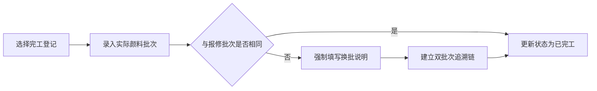

## 1. 产品概述

布袋戏偶头开脸颜料龟裂报修系统，专为偶头修复社打造的专业修复工单管理平台。实现从报修登记、队列调度、批次校验到完工追溯的全流程数字化管理，严格遵循传统工艺修复规则。

- **核心目标**：规范化偶头修复流程，智能调度插队优先级，保障颜料配伍安全，建立完整追溯链
- **目标用户**：修复社登记员、修复技师、质量管理员
- **市场价值**：填补传统工艺数字化管理空白，提升修复效率与质量可追溯性

## 2. 核心特征

### 2.1 用户角色

| 角色 | 登录方式 | 核心权限 |
|------|----------|----------|
| 登记员 | 工号登录 | 提交报修、改期/撤销、查询队列 |
| 修复技师 | 工号登录 | 查看当日队列、完工登记、记录换批 |
| 管理员 | 工号登录 | 批次档案维护、全量数据查询、统计分析 |

### 2.2 功能模块

1. **报修表单**：偶头信息录入、龟裂等级判定、颜料批次校验、槽位预约
2. **当日队列看板**：实时展示修复队列、插队标记高亮、槽位容量显示
3. **批次配伍查询**：颜料批次档案检索、可配伍批次查询、配伍规则说明
4. **单件追溯时间线**：修复全流程时间轴、换批记录追溯、状态变更历史

### 2.3 页面详情

| 页面名称 | 模块名称 | 功能描述 |
|----------|----------|----------|
| 报修表单 | 偶头信息录入 | 偶头编号自动补全、脸谱样式下拉选择 |
| 报修表单 | 龟裂等级选择 | 三选一（发丝纹/网状纹/剥落），自动计算插队优先级 |
| 报修表单 | 颜料批次校验 | 实时校验配伍表，拒绝时返回可替换批次建议 |
| 报修表单 | 槽位预约 | 上午/下午选择，显示当前槽位剩余容量 |
| 当日队列看板 | 队列列表 | 按优先级排序，显示插队标记、偶头编号、脸谱样式、龟裂等级 |
| 当日队列看板 | 槽位概览 | 上下午槽位容量进度条，超容量预警 |
| 当日队列看板 | 操作按钮 | 改期、撤销、完工登记入口 |
| 批次配伍查询 | 批次搜索 | 按批次号、颜料类型搜索档案 |
| 批次配伍查询 | 配伍列表 | 展示当前批次可配伍的所有替换批次 |
| 单件追溯时间线 | 时间轴展示 | 报修、改期、插队、完工等节点时间线 |
| 单件追溯时间线 | 换批追溯 | 高亮显示换批记录，关联两批次档案 |

## 3. 核心流程

### 3.1 报修登记流程

用户填写偶头编号、选择脸谱样式、龟裂等级、颜料批次和修复槽位。系统实时校验颜料批次配伍性，若不在配伍表内则拒绝提交并给出替换建议。校验通过后，根据龟裂等级计算队列优先级（剥落自动插队前30%），写入当日修复队列。

### 3.2 完工登记流程

修复技师选择完工按钮，录入实际耗用颜料批次。若与报修批次不同，强制填写换批说明，系统自动建立双批次追溯链。状态更新为已完工。

## 4. 用户界面设计

### 4.1 设计风格

- **主色调**：朱砂红 `#C41E3A`（传统印章红）、墨黑 `#1A1A1A`、宣纸米白 `#F5F0E8`
- **辅助色**：青铜绿 `#5C7A6D`、古金黄 `#D4A84B`
- **视觉主题**：东方传统美学融合现代简约，采用宣纸纹理背景，印章式按钮，卷轴式卡片
- **字体**：标题使用「ZCOOL XiaoWei」（站酷小薇体，书法感），正文使用「Noto Serif SC」（思源宋体）
- **按钮风格**：圆角 4px，微浮雕效果，朱砂红主按钮配金色边框
- **布局风格**：卡片式布局，卷轴分隔线，适度留白，体现传统文房气质

### 4.2 页面设计概览

| 页面名称 | 模块名称 | UI 元素 |
|----------|----------|----------|
| 报修表单 | 表单区域 | 卷轴式卡片，朱砂红标签，宋体字段，古铜色下拉框 |
| 当日队列看板 | 队列列表 | 宣纸底色表格，插队标记为红色印章样式，进度条用青铜绿渐变 |
| 批次配伍查询 | 配伍卡片 | 卷轴展开动画，批次关联用虚线连接，可配伍项打金印 |
| 单件追溯时间线 | 时间轴 | 竖轴时间线，节点用印章图标，换批节点高亮双环连线 |

### 4.3 响应式

- 桌面端优先，适配 1280px 以上分辨率
- 侧边导航栏在平板端收缩为图标，移动端改为底部 Tab 导航
- 表单字段在移动端单列布局，队列表格支持横向滚动
- 触控目标最小 44x44px，优化移动端操作体验

### 4.4 动效设计

- 页面加载：卷轴展开动画，朱砂印章逐个浮现
- 插队标记：红色印章敲章动效，带轻微弹跳
- 批次校验通过：金色对勾从中心扩散
- 时间线滚动：节点依次点亮，换批记录发光脉动
- 悬停效果：按钮微微上浮，卡片阴影加深，配 0.2s 缓动过渡
