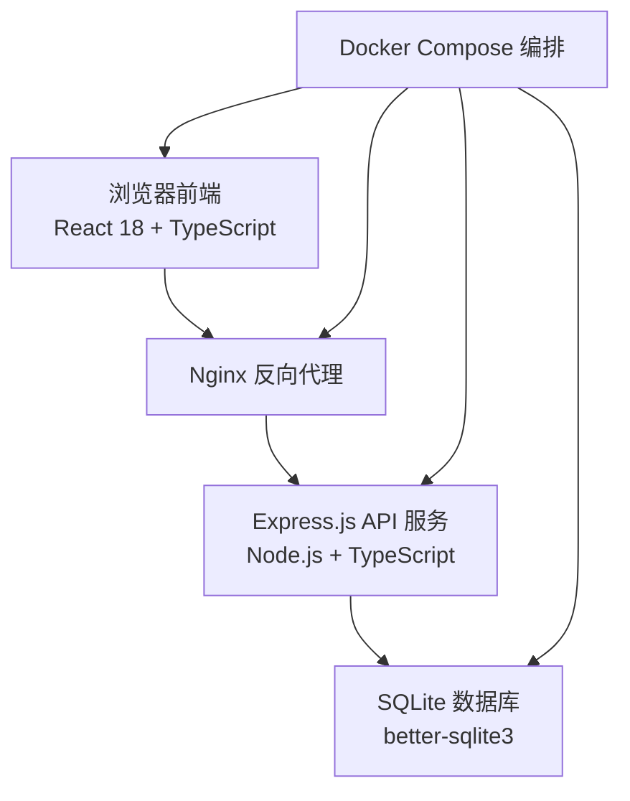
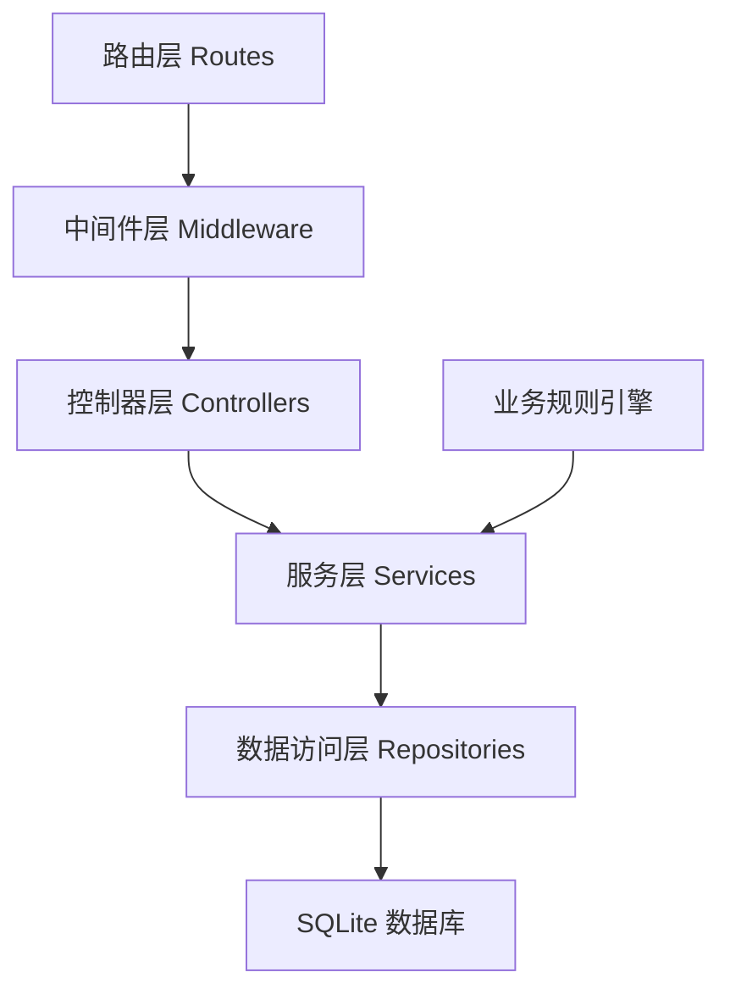
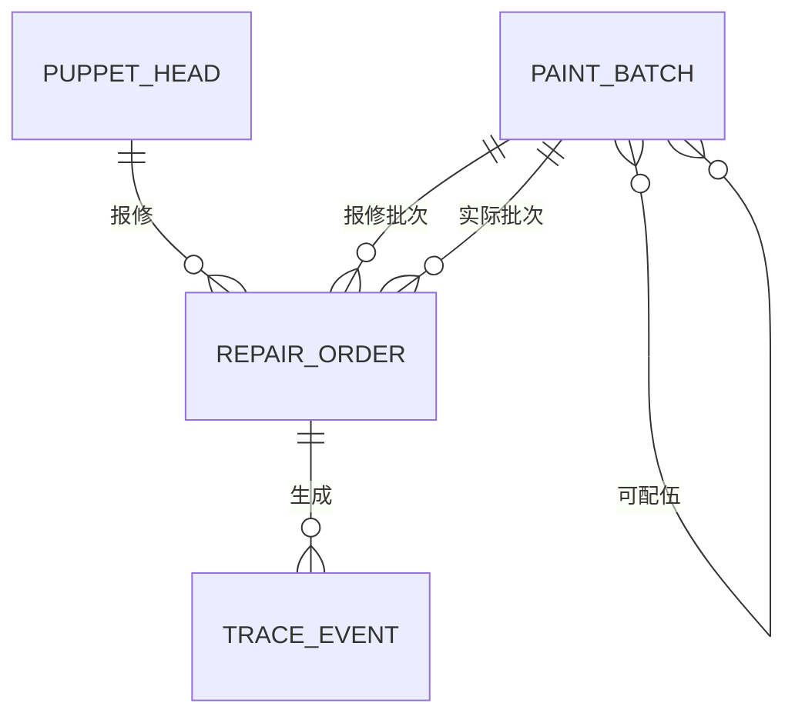

## 1. 架构设计



## 2. 技术描述

- **前端**：React 18 + TypeScript + Vite + TailwindCSS 3 + Zustand 状态管理 + React Router v6
- **后端**：Express.js 4 + TypeScript + better-sqlite3（SQLite 驱动）
- **数据库**：SQLite 3（文件型数据库，无需额外服务，适合单机部署）
- **部署**：Docker Compose 一键启动，包含前端 Nginx、后端 Node 服务
- **包管理器**：优先使用 pnpm，其次 npm
- **初始化工具**：vite-init，使用 react-express-ts 模板

## 3. 路由定义

| 路由路径 | 页面用途 |
|----------|----------|
| `/` | 报修表单页（首页） |
| `/queue` | 当日队列看板 |
| `/compatibility` | 批次配伍查询 |
| `/trace/:id` | 单件追溯时间线 |
| `/api/repairs` | 报修提交 API |
| `/api/queue` | 当日队列查询 API |
| `/api/batches` | 批次查询 API |
| `/api/repairs/:id` | 单件报修详情 API |
| `/api/repairs/:id/complete` | 完工登记 API |
| `/api/repairs/:id/reschedule` | 改期 API |
| `/api/repairs/:id/cancel` | 撤销 API |

## 4. API 定义

### 4.1 类型定义

```typescript
// 龟裂等级
type CrackLevel = 'hairline' | 'mesh' | 'peeling';

// 修复槽位
type RepairSlot = 'morning' | 'afternoon';

// 报修状态
type RepairStatus = 'pending' | 'processing' | 'completed' | 'cancelled' | 'rescheduled';

// 偶头信息
interface PuppetHead {
  id: string;
  headCode: string;
  faceStyle: string;
  createdAt: string;
}

// 颜料批次
interface PaintBatch {
  id: string;
  batchCode: string;
  paintType: string;
  manufactureDate: string;
  compatibleBatches: string[];
}

// 报修记录
interface RepairOrder {
  id: string;
  orderNo: string;
  puppetHeadId: string;
  headCode: string;
  faceStyle: string;
  crackLevel: CrackLevel;
  paintBatchId: string;
  paintBatchCode: string;
  actualPaintBatchId?: string;
  actualPaintBatchCode?: string;
  batchChangeNote?: string;
  slot: RepairSlot;
  repairDate: string;
  status: RepairStatus;
  priority: number;
  isJumped: boolean;
  jumpReason?: string;
  createdAt: string;
  completedAt?: string;
  rescheduledAt?: string;
  rescheduleCount: number;
}

// 追溯事件
interface TraceEvent {
  id: string;
  repairOrderId: string;
  eventType: 'created' | 'jumped' | 'rescheduled' | 'cancelled' | 'completed' | 'batch_changed';
  eventDesc: string;
  createdAt: string;
  metadata?: Record<string, any>;
}
```

### 4.2 请求响应结构

```typescript
// 提交报修请求
interface CreateRepairRequest {
  headCode: string;
  faceStyle: string;
  crackLevel: CrackLevel;
  paintBatchCode: string;
  slot: RepairSlot;
  repairDate: string;
}

// 提交报修响应
interface CreateRepairResponse {
  success: boolean;
  data?: RepairOrder;
  error?: {
    code: string;
    message: string;
    suggestedBatches?: PaintBatch[];
  };
}

// 完工登记请求
interface CompleteRepairRequest {
  actualPaintBatchCode: string;
  batchChangeNote?: string;
}

// 改期请求
interface RescheduleRequest {
  newSlot: RepairSlot;
  newDate: string;
}
```

## 5. 服务器架构图



## 6. 数据模型

### 6.1 ER 图



### 6.2 DDL 语句

```sql
-- 偶头表
CREATE TABLE puppet_heads (
  id TEXT PRIMARY KEY,
  head_code TEXT UNIQUE NOT NULL,
  face_style TEXT NOT NULL,
  created_at TEXT NOT NULL DEFAULT (datetime('now'))
);

-- 颜料批次表
CREATE TABLE paint_batches (
  id TEXT PRIMARY KEY,
  batch_code TEXT UNIQUE NOT NULL,
  paint_type TEXT NOT NULL,
  manufacture_date TEXT NOT NULL,
  created_at TEXT NOT NULL DEFAULT (datetime('now'))
);

-- 批次配伍关联表
CREATE TABLE batch_compatibility (
  id TEXT PRIMARY KEY,
  batch_id TEXT NOT NULL,
  compatible_batch_id TEXT NOT NULL,
  created_at TEXT NOT NULL DEFAULT (datetime('now')),
  FOREIGN KEY (batch_id) REFERENCES paint_batches(id),
  FOREIGN KEY (compatible_batch_id) REFERENCES paint_batches(id),
  UNIQUE(batch_id, compatible_batch_id)
);

-- 报修单表
CREATE TABLE repair_orders (
  id TEXT PRIMARY KEY,
  order_no TEXT UNIQUE NOT NULL,
  puppet_head_id TEXT NOT NULL,
  head_code TEXT NOT NULL,
  face_style TEXT NOT NULL,
  crack_level TEXT NOT NULL CHECK (crack_level IN ('hairline', 'mesh', 'peeling')),
  paint_batch_id TEXT NOT NULL,
  paint_batch_code TEXT NOT NULL,
  actual_paint_batch_id TEXT,
  actual_paint_batch_code TEXT,
  batch_change_note TEXT,
  slot TEXT NOT NULL CHECK (slot IN ('morning', 'afternoon')),
  repair_date TEXT NOT NULL,
  status TEXT NOT NULL DEFAULT 'pending' CHECK (status IN ('pending', 'processing', 'completed', 'cancelled', 'rescheduled')),
  priority INTEGER NOT NULL DEFAULT 0,
  is_jumped INTEGER NOT NULL DEFAULT 0,
  jump_reason TEXT,
  created_at TEXT NOT NULL DEFAULT (datetime('now')),
  completed_at TEXT,
  rescheduled_at TEXT,
  reschedule_count INTEGER NOT NULL DEFAULT 0,
  FOREIGN KEY (puppet_head_id) REFERENCES puppet_heads(id),
  FOREIGN KEY (paint_batch_id) REFERENCES paint_batches(id),
  FOREIGN KEY (actual_paint_batch_id) REFERENCES paint_batches(id)
);

-- 追溯事件表
CREATE TABLE trace_events (
  id TEXT PRIMARY KEY,
  repair_order_id TEXT NOT NULL,
  event_type TEXT NOT NULL,
  event_desc TEXT NOT NULL,
  metadata TEXT,
  created_at TEXT NOT NULL DEFAULT (datetime('now')),
  FOREIGN KEY (repair_order_id) REFERENCES repair_orders(id)
);

-- 索引
CREATE INDEX idx_repair_orders_date_slot ON repair_orders(repair_date, slot);
CREATE INDEX idx_repair_orders_status ON repair_orders(status);
CREATE INDEX idx_trace_events_order ON trace_events(repair_order_id);
```

### 6.3 种子数据

```sql
-- 偶头种子数据（6件）
INSERT INTO puppet_heads (id, head_code, face_style) VALUES
  ('ph001', 'OH-2024-001', '生角'),
  ('ph002', 'OH-2024-002', '旦角'),
  ('ph003', 'OH-2024-003', '净角'),
  ('ph004', 'OH-2024-004', '末角'),
  ('ph005', 'OH-2024-005', '丑角'),
  ('ph006', 'OH-2024-006', '花脸');

-- 颜料批次种子数据
INSERT INTO paint_batches (id, batch_code, paint_type, manufacture_date) VALUES
  ('pb001', 'RED-2024-A01', '朱砂红', '2024-01-15'),
  ('pb002', 'RED-2024-A02', '朱砂红', '2024-02-20'),
  ('pb003', 'RED-2024-B01', '朱砂红', '2024-03-10'),
  ('pb004', 'BLK-2024-A01', '松烟墨', '2024-01-15'),
  ('pb005', 'BLK-2024-A02', '松烟墨', '2024-02-25'),
  ('pb006', 'WHT-2024-A01', '铅白粉', '2024-01-20');

-- 配伍关联
INSERT INTO batch_compatibility (id, batch_id, compatible_batch_id) VALUES
  ('bc001', 'pb001', 'pb002'),
  ('bc002', 'pb002', 'pb001'),
  ('bc003', 'pb002', 'pb003'),
  ('bc004', 'pb003', 'pb002'),
  ('bc005', 'pb004', 'pb005'),
  ('bc006', 'pb005', 'pb004');

-- 2条换批记录样例
INSERT INTO repair_orders (id, order_no, puppet_head_id, head_code, face_style, crack_level, paint_batch_id, paint_batch_code, actual_paint_batch_id, actual_paint_batch_code, batch_change_note, slot, repair_date, status, priority, is_jumped, jump_reason, created_at, completed_at, reschedule_count) VALUES
  ('ro001', 'BX20240601001', 'ph001', 'OH-2024-001', '生角', 'hairline', 'pb001', 'RED-2024-A01', 'pb002', 'RED-2024-A02', '原批次库存不足，经配伍校验更换为同系列批次', 'morning', '2024-06-01', 'completed', 5, 0, NULL, '2024-06-01 08:30:00', '2024-06-01 10:15:00', 0),
  ('ro002', 'BX20240601002', 'ph003', 'OH-2024-003', '净角', 'peeling', 'pb004', 'BLK-2024-A01', 'pb005', 'BLK-2024-A02', '原批次颜料干结失效，更换为新生产批次', 'afternoon', '2024-06-01', 'completed', 1, 1, '龟裂等级为剥落，自动插队', '2024-06-01 09:15:00', '2024-06-01 15:30:00', 0);

-- 追溯事件
INSERT INTO trace_events (id, repair_order_id, event_type, event_desc, metadata, created_at) VALUES
  ('te001', 'ro001', 'created', '提交报修', '{"slot":"morning","crackLevel":"hairline"}', '2024-06-01 08:30:00'),
  ('te002', 'ro001', 'batch_changed', '更换颜料批次', '{"oldBatch":"RED-2024-A01","newBatch":"RED-2024-A02","note":"原批次库存不足，经配伍校验更换为同系列批次"}', '2024-06-01 09:45:00'),
  ('te003', 'ro001', 'completed', '修复完工', '{}', '2024-06-01 10:15:00'),
  ('te004', 'ro002', 'created', '提交报修', '{"slot":"afternoon","crackLevel":"peeling"}', '2024-06-01 09:15:00'),
  ('te005', 'ro002', 'jumped', '队列插队', '{"reason":"龟裂等级为剥落，自动插队","oldPriority":3,"newPriority":1}', '2024-06-01 09:15:01'),
  ('te006', 'ro002', 'batch_changed', '更换颜料批次', '{"oldBatch":"BLK-2024-A01","newBatch":"BLK-2024-A02","note":"原批次颜料干结失效，更换为新生产批次"}', '2024-06-01 14:20:00'),
  ('te007', 'ro002', 'completed', '修复完工', '{}', '2024-06-01 15:30:00');

-- 1条配伍拒绝样例（未成功创建的报修记录，用于演示）
-- 实际场景中 pb006 (WHT-2024-A01) 没有配伍记录，提交时会被拒绝
```
